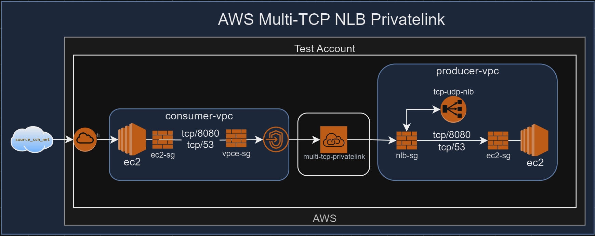

# aws-privatelink-protocol-tester
- [Overview](#overview)
  - [Key Features](#key-features)
  - [Goals](#goals)
  - [Test Cases](#test-cases)
  - [Project Structure](#project-structure)
  - [Important Notes](#important-notes)
  - [Considerations](#considerations)
  - [Prerequisites](#prerequisites)
  - [Usage](#usage)
  - [TO DO](#to-do)
  - [Contributing](#contributing)
  - [Disclaimer](#disclaimer)
  - [License](#license)


# Overview 

This repository contains Terraform configuration files and various scripts for setting up a test environment to test AWS Privatelink Service Providers and Consumers.

## Key Features
- Builds consumer/producer vpc endpoints and privatelink services as well as the supporting infrastructure to test. 

# Goals

- Test UDP Behind privatelink :no_entry_sign:

  - UDP Does not work; 
    ```
    Error: creating EC2 VPC Endpoint Service: operation error EC2: CreateVpcEndpointServiceConfiguration, https response error StatusCode: 400, RequestID: 8fae1f50-a53d-465b-974d-6ae00ced277e, api error InvalidParameter: Network load balancer with arn "arn:aws:elasticloadbalancing:us-east-1:<ACCOUNT>:loadbalancer/net/udp-nlb/0cbd4b49473868f3" has UDP listeners. Privatelink does not support UDP.
    ```
    > https://docs.aws.amazon.com/vpc/latest/privatelink/concepts.html#concepts-service-consumers
    > - Interface - Create an interface endpoint to send ***TCP*** traffic to an endpoint service.
- Test TCP/UDP listeners on same NLB behind privatelink. :no_entry_sign:

  - TCP and UDP listeners it does not like; 
    ```
    │ Error: creating EC2 VPC Endpoint Service: operation error EC2: CreateVpcEndpointServiceConfiguration, https response error StatusCode: 400, RequestID: b7ea2c9e-abfa-4371-af28-7f25e475e5c6, api error InvalidParameter: Network load balancer with arn "arn:aws:elasticloadbalancing:us-east-1:<ACCOUNT>:loadbalancer/net/tcp-udp-nlb/3b887e7b44ff64f4" has UDP listeners. Privatelink does not support UDP.
    │   with aws_vpc_endpoint_service.producer_tcp_udp_privatelink_service,
    │   on privatelink.tf line 14, in resource "aws_vpc_endpoint_service" "producer_tcp_udp_privatelink_service":
    │   14: resource "aws_vpc_endpoint_service" "producer_tcp_udp_privatelink_service" {
    ```

- Test Multiple TCP listeners on single NLB behind privatelink. :white_check_mark:

  -[2024-10-27 Log Results](https://github.com/drewpypro/aws-privatelink-protocol-tester/blob/main/tests/2024-10-27_21-08-23-log.txt)
  -[2024-10-27 Report](https://github.com/drewpypro/aws-privatelink-protocol-tester/blob/main/tests/2024-10-27_21-08-23-report.csv)
- Test Syn w/data & TCP FO through privatelink. :white_check_mark:
  - Syn w/ Data works through Privatelink
    
  - TCP Fast Open works through Privatelink :white_check_mark:
    
- Test http headers through privatelink. :white_check_mark:
  - Bad http headers can be passed through privatelink. 
    
- Test non-http protocols through privatelink. (ssh) :white_check_mark:
  -[Consumer SSH Pcap](https://github.com/drewpypro/aws-privatelink-protocol-tester/blob/main/tests/10-27-2024-ssh-consumer-privatelink-test.pcap)
  -[Producer SSH Pcap](https://github.com/drewpypro/aws-privatelink-protocol-tester/blob/main/tests/10-27-2024-ssh-producer-privatelink-test.pcap)
- Create report with vpc flow logs.
- Create diagram based on logs
- Provide cost estimate breakdown

# Test Cases

| Test Case Description                             | Allowed/Denied                   | TestDetail/Result                                |
|---------------------------------------------------|----------------------------------|--------------------------------------------------|
| Http Traffic                                      | :white_check_mark:               | Can establish http connectivity using privatelink |
| Non-Http Traffic                                  | :white_check_mark:               | Can establish ssh connectivity using privatelink  |
| UDP Traffic                                       | :no_entry_sign:                  | AWS doesn't allow an NLB with a UDP listener behind Privatelink as of today |
| TCP/UCP NLB                                       | :no_entry_sign:                  | AWS doesn't allow an NLB with a UDP listener behind Privatelink as of today |
| Multiple TCP Listener NLB                         | :white_check_mark:               | Can establish connectivity to both ports through a single privatelink |
| SSH through privatelink                           | :white_check_mark:               | Able to ssh through privatelink on port 22 |
| Tunneled UDP through TCP NLB                      | Likely allowed?                  | Create TCP session that tunnels UDP protocols |
| TCP Fast Open (bidirectional SYN data)            | :white_check_mark:               | Able to communicate client2server using TCP FO without establishing tcp session |
| TCP Split Handshake                               | Likely not blocked?              | Try to establish connection using split handshake. Check if AWS blocks it.         |
| TCP SYN Flood                                     | Possible rate limiting by AWS?   | Flood target endpoint with SYN requests and observe behavior.                      |
| SSL-Based Attacks (e.g., Heartbleed, POODLE)      | Unlikely without decryption?     | Attempt SSL-based attacks over PrivateLink to see if any get blocked.              |
| Application Layer Check (App-ID != SSL)           | Not available?                   | Send traffic through PrivateLink and try to detect mismatched protocol identifiers.|
| Fragmented Traffic Handling                       | Uncertain?                       | Send fragmented packets to the endpoint to check if AWS blocks or permits.         |
| TCP SYN with Data                                 | :white_check_mark:               | Able to receive data in TCP syn   |
| Strict IP Address Check (source validation)       | Uncertain                        | Attempt using spoofed source IP address and see if it passes.                     |
| Spoofed IP Address                                | Likely not blocked?              | Test by using a spoofed source IP for connections through PrivateLink.             |
| Reconnaissance (TCP Port Scan)                    | Unlikely to be blocked?          | Perform a TCP SYN scan and check logs for detection or blocking behavior.          |


## Project Structure
```
aws-privatelink-protocol-tester/
├── img/
├── scripts/
│   ├── consumer_ec2.sh    # Consumer startup script
│   ├── producer_ec2.sh    # Producer startup script
├── ec2.tf                 # Terraform configuration file for defining EC2 instances and related resources.
├── iam.tf                 # Terraform configuration file for defining IAM roles, policies, and profiles.
├── nlb.tf                 # Terraform configuration file for defining NLB, listeners and target groups.
├── privatelink.tf         # Terraform configuration file for defining AWS PrivateLink endpoints and related resources.
├── README.md              # Markdown file for documenting the project, including descriptions of files and usage.
├── sg.tf                  # Terraform configuration file for defining security groups and their rules.
├── variables.tf           # Terraform configuration file for defining variable declarations.
├── vpc.tf                 # Terraform configuration file for defining VPC, subnets, and related networking resources.
```

## Important Notes


## Considerations
- **DO NOT RUN THIS IN A PRODUCTION ENVIRONMENT**
- Take these results with a grain of salt and do your own thorough testing with your own test cases.
- More tests are needed, such as working scenarios of cross-account access and commands that succeed fully.
- This is as far as I am in my learning journey, hopefully this helps yours and I appreciate any feedback.

## Prerequisites

1. An AWS account an api keys with access
2. Github account with Github Actions
3. Git installed
4. An ssh/scp client (to login/export results)


## Usage

 - After resources are created, ssh into the consumer ec2 instance via the provided output for the elastic IP. 
 - Once you are logged in, you can run the VPC Privatelink Tester script using: 

```bash
python aws_privatelink_protocol_tester.py [OPTIONS]
```

For available options, run:

```bash
python aws_privatelink_protocol_tester.py --help
    Usage: aws_privatelink_protocol_tester.py [OPTIONS]

    Options:
    --log          Generate a full log file with $day/hour/minute-log.txt.
    --report       Generate a CSV report with $day/hour/minute-report.csv.
    --both         Generate both log and report files.
    --shell        Output only to the shell without writing any files.
    
    Examples:
    python aws_privatelink_protocol_tester.py --log
    python aws_privatelink_protocol_tester.py --report
    python aws_privatelink_protocol_tester.py --both
    python aws_privatelink_protocol_tester.py --shell
```

## TO DO:
 - Automated flow log and report creation in script
    - consumer script runs and ends with sleep 15(or whatever time it takes for flow logs to populate?)
    - after sleep pulls flow logs into csv along with report and saves to file. 
 - Billing monitoring
    - Automatically pull billing activity during testing to be saved with repo for review later. 


## Contributing

Feel free to submit issues, create pull requests, or fork the repository to help improve the project.

## Disclaimer

This project is for testing and educational purposes only. The author is not responsible for any misuse or damage caused by this tool. Use at your own risk and always test in a safe, non-production environment.

## License

[MIT License](LICENSE)